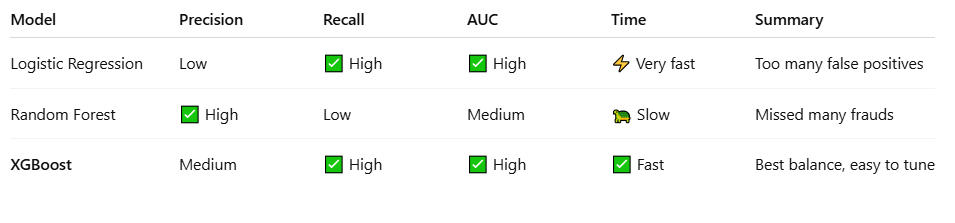

# 🛡️ FraudWatch AI – Mobile Payment Fraud Detection

Detect fraudulent transactions in mobile payment systems using **Machine Learning** and **Explainable AI** techniques.

  
   

---

## 📂 Dataset

- **Name**: PaySim Mobile Transactions Simulation Dataset  
- **Size**: ~1.4 million transactions  
- **Imbalance**: Only ~0.12% of transactions are fraudulent  
- **Target**: `isFraud`  
- [📎 Dataset Reference](https://www.kaggle.com/datasets/ntnu-testimon/paysim1)

---

## ⚙️ Project Pipeline

### 📌 Step-by-step Workflow:

1. **📥 Load Dataset**  
   Downloaded from [Google Drive](https://drive.google.com/...) and read in `pandas`.

2. **🧼 Preprocessing**
   - Dropped unnecessary columns: `nameOrig`, `nameDest`, `isFlaggedFraud`
   - One-hot encoded `type`
   - Created engineered features:  
     - `balance_diff_orig = oldbalanceOrg - newbalanceOrig`  
     - `balance_diff_dest = newbalanceDest - oldbalanceDest`

3. **⚖️ Handling Imbalance**
   - Used `SMOTE` to oversample minority class (fraudulent transactions)

4. **🧠 Model Training**
   - Trained and evaluated:
     - ✅ Logistic Regression
     - ✅ Random Forest
     - ✅ XGBoost
   - Evaluated using:
     - Precision, Recall, F1-Score
     - AUC-PR
     - Confusion Matrix
## 📊 Model Performance Comparison




5. **⏱️ Timed Comparison**
   - Compared training and prediction times across models

6. **🚀 Deployment with Streamlit**
   - Created an interactive fraud prediction web app  
   - User uploads CSV or enters transaction details  
   - Outputs probability of fraud and decision

---

## 🔁 Flowchart of Entire Pipeline

```mermaid
graph TD
    A[Start] --> B[Load Dataset from Drive]
    B --> C[Clean Data & Drop Unused Columns]
    C --> D[Feature Engineering]
    D --> E[One-Hot Encoding Transaction Type]
    E --> F[Split Train/Test Data]
    F --> G[Apply SMOTE to Training Set]
    G --> H[Train Models<br>LogReg / RF / XGBoost]
    H --> I[Evaluate Models<br>Precision, Recall, AUC]
    I --> J[Time Comparison]
    J --> K[Streamlit App Deployment]
    K --> L[Predict on New Transaction]
    L --> M[Show Result to User]
